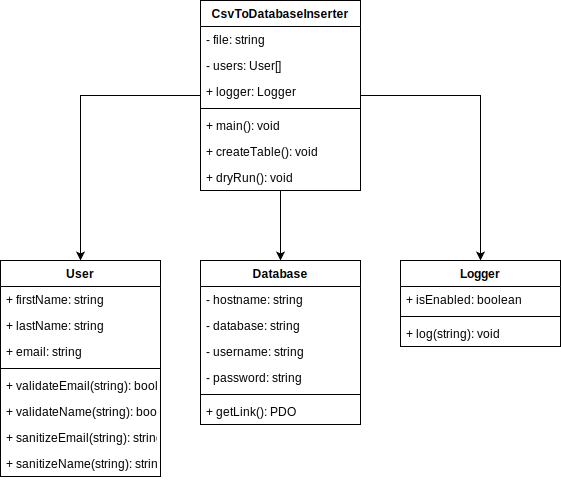

# script-task

`script-task` is a PHP script, that is executed from the command line. It accepts a CSV file as input and processes the CSV file. The parsed file data is to be inserted into a MySQL database. A CSV file is provided `users.csv`, this contains test data, the script will process this file appropriately. The script is based on the following class diagram:



## Goals

* Handle CSV file that contains columns: name, surname, email
* Parse this data to an arbitrary list of users
* All the values are sanitized, for example `joHn` should be stored as `John`
* All values are validated before being inserted so that the database holds clean data only
* The program can be run without altering database
* Code compliance for [PSR-1], [PSR-2] and [PSR-4]. The logger used in this program uses the logger interface from [PSR-3]. If you notice compliance oversights, please send a patch via pull request.

## Install

1. Composer

``` bash
$ composer install
```

2. Then edit `config.ini` to your database settings

## Usage

The script should be used like this
``` bash
$ php user_upload.php [options] <filename>
```

The script includes the following commands (directives):
* `--file` - it requires a value of type `string`. This is the name of the CSV file to be parsed
* `--create_table` - this will cause the MySQL users table to be build/rebuild
* `--dry_run` - when this option is set, the database will not be altered
* `-u` - it required a value of type `string`. This will override the MySQL username defined in `config.ini`
* `-p` - it required a value of type `string`. This will override the MySQL password defined in `config.ini`
* `-h` - it required a value of type `string`. This will override the MySQL host defined in `config.ini`
* `--help` - if option is set it will output above directives with details.


## Requirements

* PHP version ^7.2.x
* [Composer](https://getcomposer.org/) version ^1.10.x
* MySQL database server version 5.7 or higher (MariaDB 10.x)
* Database in MySQL named `catalyst-challenge` (if this differs then edit `config.ini`)

## Testing

``` bash
$ .\vendor\bin\phpunit --testdox tests
```

---

# Logic test

`foobar.php` is a script taht outputs numbers from 1 to 100, and logs how long the script ran in seconds. It does this in the following way:
 * Where the number is divisable by three (3) output is the word "foo" instead of the number.
 * Where the number is divisable by five (5) output is the word "bar" instead of the number.
 * Where the number is divisavle by three (3) and five (5) output the word "foobar".
 * Otherwise just print the number.

## Install

Download `foobar.php` and paste it somewhere on your computer

## Usage

The script should be used like this
``` bash
$ php footbar.php
```

 ## Requirements

* PHP version ^7.2.x